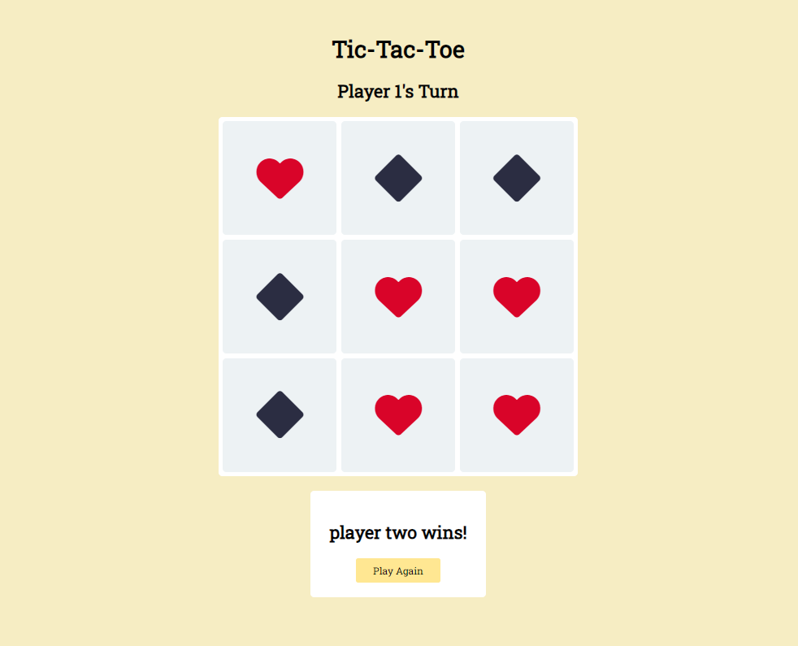

# tic-tac-toe

[Live Demo](https://mrespicio.github.io/tic-tac-toe/)

## Preview

## Project Goals
Create a Tic-Tac-Toe web application focusing on closure and creating private variables for more organized code.

## The Plan
First and foremost, I must create the basic objects that will be used in this game - the gameboard and players. The gameboard object will have all variables and methods pertaining to the overall game. Player objects will have data relevant to themselves, most importantly - the spaces that each player will hold on the board. With this, I can create functions to implement the logic to run the game and can refer to variables inside of the game and player objects. 
I will then need to display the game flow by manipulating the DOM. Once I'm satisfied with all the logic and functionality of the basic game, I can style the game.

## Build With
### Technologies
* HTML
* CSS
* JavaScript

### Tools and more
* Git and GitHub
* Visual Studio Code
* Font Awesome 6

## New Skills
* Implemented factories and module patterns 
* Used private variables and methods to restrict access to code and manage global namespace

## Reflection
This project challenged me to use as little global code as possible and put everything in a module or factory. Despite this challenge, focusing on using module and factory patterns actually made figuring out a solution easier. I was able to organize specific methods into objects and keep relevant code together. I was also able to reference and change variables more easily as their scope was easy to keep track of.
This was a fun project for me as I had to write my code deliberately and learned new ways to organize my code.

## Misc
This project was created as an assignment for [The Odin Project](https://www.theodinproject.com/lessons/node-path-javascript-tic-tac-toe)
Completed: Oct 2023